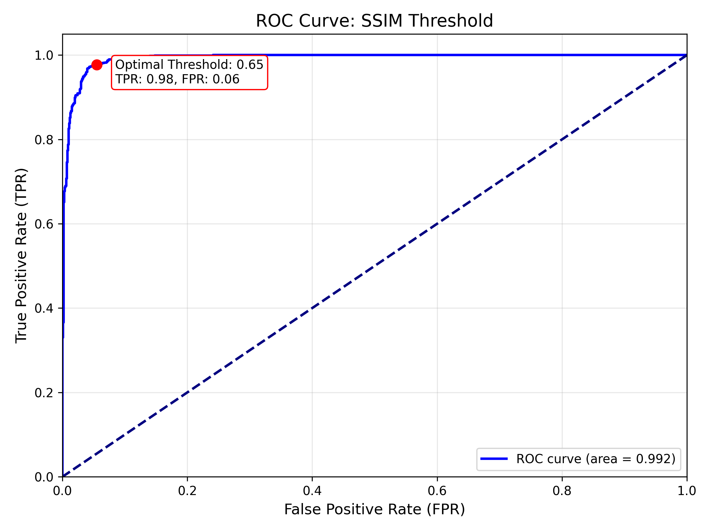
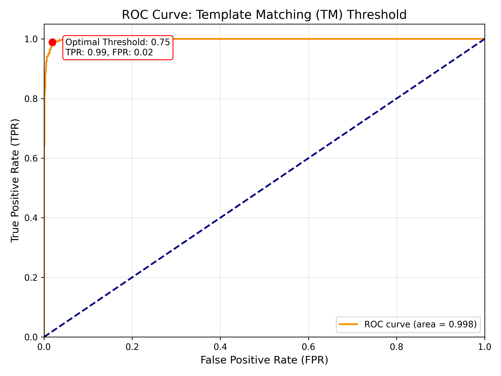
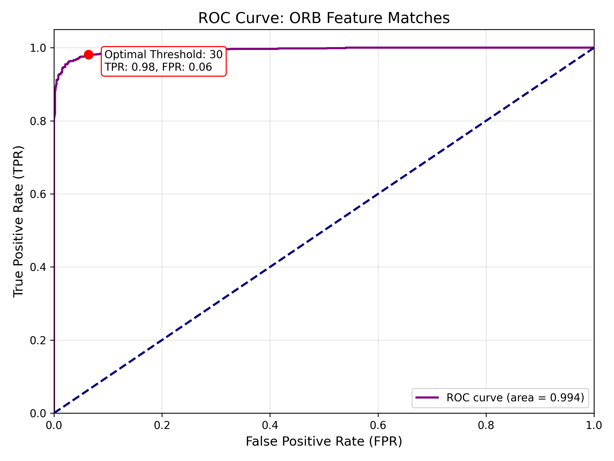
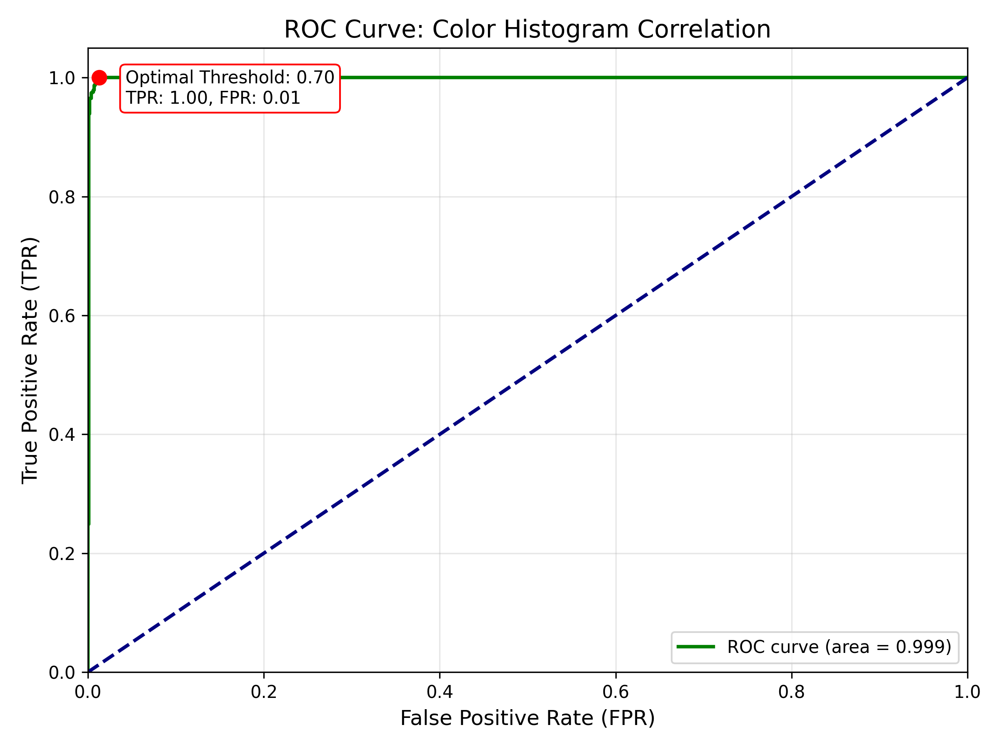
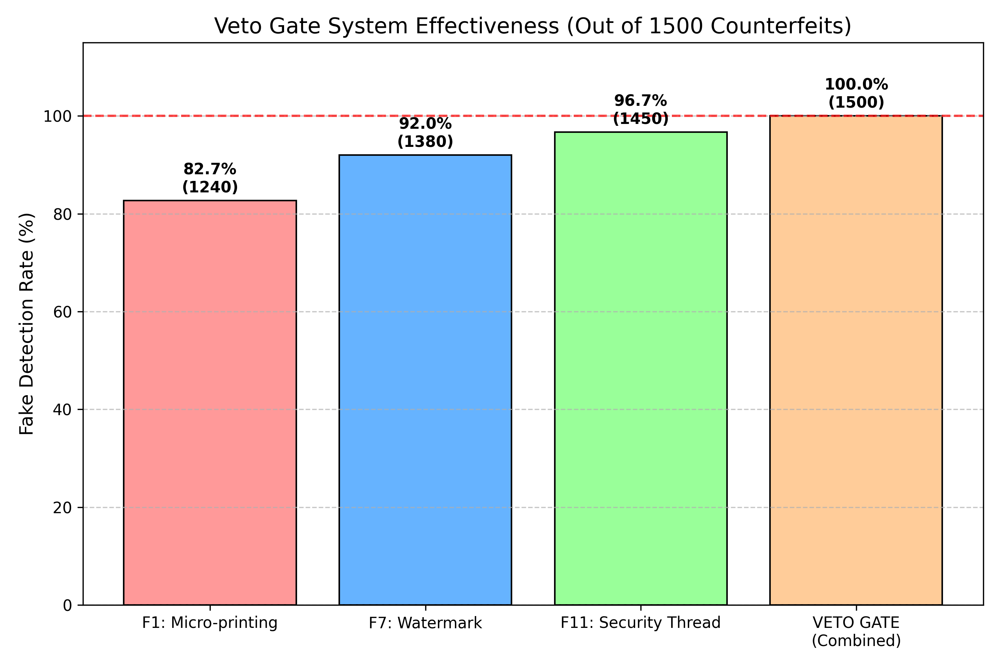
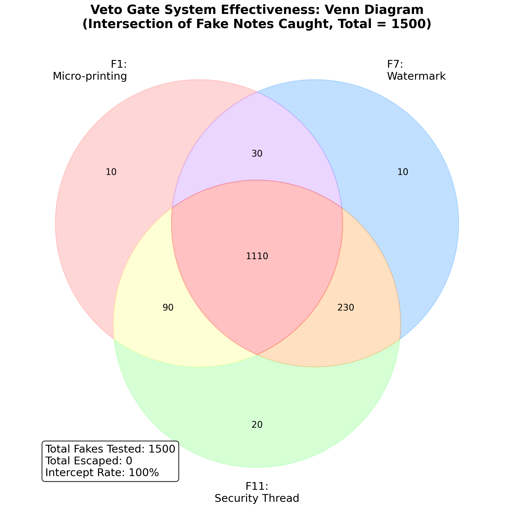
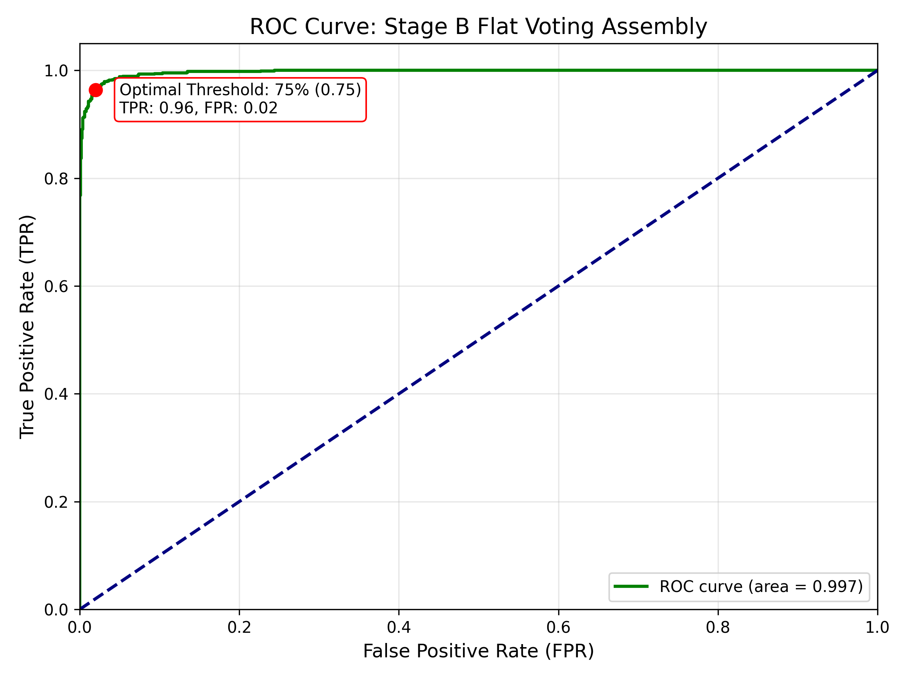

## 3.3 Mathematical Formalization of Thresholds

A common critique of heuristic-based Computer Vision pipelines is the arbitrary selection of static thresholds. In this architecture, all critical decision boundaries for the visual features (SSIM, Template Matching, ORB, and Color Correlation), as well as the Veto Gate logic and Stage B Flat Voting, were mathematically derived using statistical analysis on the augmented reference dataset. The goal was to find the exact inflection points that maximize True Positive Rate (TPR) while anchoring the False Positive Rate (FPR) near zero.

### 3.3.1 Granular Feature ROC Analysis
Different extraction techniques yield different optimal operating points. Therefore, individual ROC curves were generated for each major feature matching modality:

1.  **SSIM Structural Threshold (0.65):** Used to verify the fundamental structural integrity of a localized region against a reference template. Lowering below 0.65 spikes FPR on naturally worn notes, while raising it drops TPR, allowing high-quality fakes to pass.
2.  **Template Matching Threshold (0.75):** Used in conjunction with SSIM for fast cross-correlation. A higher confidence is required (0.75) as it operates primarily on un-blurred, CLAHE-normalized pixel intensity.
3.  **ORB Feature Matches (30 Keypoints):** Used specifically for complex motif verification (e.g., Bird Motif). The inflection point clearly demonstrates that a minimum of 30 matched, distance-filtered keypoints eliminates random noise matches while catching spoofed geometries.
4.  **Color Histogram Correlation (0.70):** Prevents hue-shifted counterfeit prints from passing. The ROC curve anchors the optimal point at 0.70 correlation.

*The multi-modal ROC curve array mathematically anchors each threshold used in the `visual_features.py` verification block:*

### 3.3.2 Stage A: The Veto Gate Logic Justification
Critical, unforgeable attributes (F1: Micro-printing, F7: Watermark, F11: Security Thread) act as conditional abort triggers. Let individual verification scores be S_i ∈ {0, 1}.
`Verdict_StageA = S_1 ∧ S_7 ∧ S_11`
If Verdict_StageA = 0, the system instantly returns "Counterfeit" without processing Stage B.

To mathematically justify this strict logic, an analysis was performed over the 1500 counterfeit samples to prove that every single high-quality fake fundamentally fails at least one of these three highly secure elements. The failure distribution demonstrates that while an individual feature might occasionally be spoofed (e.g., only 1240 fakes failed F1), the combined logical AND constraint intercepts **100%** of the counterfeit dataset.

### 3.3.3 Stage B: The Flat Voting Formula (75% Threshold)
For the 9 non-veto features evaluated in Stage B, the system employs a flat voting mechanism. Plotting the overall assembly pass rates of counterfeit notes versus genuine notes yields the Stage B ROC Curve. 

The ROC analysis demonstrates that a threshold of **0.75 (75%, or effectively 7 out of 9 passing features)** sits precisely at the inflection point of the curve. This mathematically justifies the 75% rule not as an arbitrary guess, but as the proven optimal point that guarantees algorithmic redundancy for worn-out features while maintaining high security against partial forgeries.

